# MDAgents 智能诊断系统完整流程图

## Multi-Omics Diagnosis Workflow with CMO Chain-of-Thought Reasoning

```mermaid
flowchart TB
    Start([用户输入自然语言请求<br>User Natural Language Request]) --> Parse[RequestParser解析<br>Parse Request]

    Parse --> Config{DiagnosisConfig配置<br>Configuration}

    Config --> |组学类型<br>Omics Types| DataLoad[数据加载模块<br>Data Loading]
    Config --> |病人ID/行范围<br>Patient IDs/Rows| DataLoad
    Config --> |启用RAG/CAG<br>Enable RAG/CAG| DataLoad
    Config --> |辩论轮数<br>Debate Rounds| DataLoad

    DataLoad --> CheckCache{检查预处理缓存<br>Check Preprocessed Cache}

    CheckCache --> |缓存存在<br>Cache Exists| LoadCache[从Parquet文件加载<br>Load from Parquet]
    CheckCache --> |缓存不存在<br>No Cache| Preprocess[预处理数据<br>Preprocess Data]

    Preprocess --> SaveCache[保存为Parquet<br>Save as Parquet]
    SaveCache --> LoadCache

    LoadCache --> Filter[数据筛选<br>Filter Data]
    Filter --> |按病人ID<br>By Patient ID| FilteredData[筛选后数据<br>Filtered Data]
    Filter --> |按行范围<br>By Row Range| FilteredData

    FilteredData --> Expert1[微生物组专家<br>Microbiome Expert]
    FilteredData --> Expert2[代谢组专家<br>Metabolome Expert]
    FilteredData --> Expert3[蛋白质组专家<br>Proteome Expert]

    Expert1 --> Opinion1[专家意见1<br>Opinion 1:<br>诊断+概率+置信度+生物标志物]
    Expert2 --> Opinion2[专家意见2<br>Opinion 2:<br>诊断+概率+置信度+生物标志物]
    Expert3 --> Opinion3[专家意见3<br>Opinion 3:<br>诊断+概率+置信度+生物标志物]

    Opinion1 --> ConflictDetect{冲突检测<br>Conflict Detection}
    Opinion2 --> ConflictDetect
    Opinion3 --> ConflictDetect

    ConflictDetect --> |无冲突+不强制RAG<br>No Conflict| QuickDecision[快速决策<br>Quick Decision:<br>多数投票或加权]
    ConflictDetect --> |无冲突+强制RAG<br>No Conflict + Force RAG| ForceRAG[强制RAG查询<br>Forced RAG Query]
    ConflictDetect --> |有冲突<br>Has Conflict| DebateStart[启动辩论流程<br>Start Debate]

    QuickDecision --> ReportGen
    ForceRAG --> RAG

    DebateStart --> DebateRound1[辩论第1轮<br>Debate Round 1]

    DebateRound1 --> AdjustThreshold1[调整决策阈值<br>Adjust Threshold]
    AdjustThreshold1 --> RecordRound1[记录专家意见分布<br>Record Expert Distribution]
    RecordRound1 --> CheckResolved1{冲突已解决?<br>Conflict Resolved?}

    CheckResolved1 --> |是<br>Yes| CMODecision
    CheckResolved1 --> |否<br>No| DebateRound2[辩论第2轮<br>Debate Round 2]

    DebateRound2 --> AdjustThreshold2[调整决策阈值<br>Adjust Threshold]
    AdjustThreshold2 --> RecordRound2[记录专家意见分布<br>Record Expert Distribution]
    RecordRound2 --> CheckResolved2{冲突已解决?<br>Conflict Resolved?}

    CheckResolved2 --> |是<br>Yes| CMODecision
    CheckResolved2 --> |否<br>No| DebateRound3[辩论第3轮<br>Debate Round 3]

    DebateRound3 --> AdjustThreshold3[调整决策阈值<br>Adjust Threshold]
    AdjustThreshold3 --> RecordRound3[记录专家意见分布<br>Record Expert Distribution]
    RecordRound3 --> CheckResolved3{冲突已解决?<br>Conflict Resolved?}

    CheckResolved3 --> |是<br>Yes| CMODecision
    CheckResolved3 --> |否，达到最大轮数<br>No, Max Rounds| RAG

    RAG[RAG文献检索<br>Medical Literature Search] --> CAG[CAG案例检索<br>Similar Cases Retrieval]

    CAG --> CMODecision[CMO最终决策<br>CMO Final Decision]

    CMODecision --> CoTPrompt[构建CoT提示词<br>Build CoT Prompt:<br>包含辩论演化+专家意见+RAG+CAG]

    CoTPrompt --> LLMCall[调用LLM<br>Call LLM async]

    LLMCall --> ParseJSON{解析JSON响应<br>Parse JSON Response}

    ParseJSON --> |成功<br>Success| ExtractCoT[提取6步推理<br>Extract 6-Step CoT]
    ParseJSON --> |失败<br>Failure| Fallback[回退策略<br>Fallback:<br>加权诊断]

    ExtractCoT --> CoTStep1[步骤1: 专家共识分析<br>Step 1: Expert Consensus]
    CoTStep1 --> CoTStep2[步骤2: 生物标志物评估<br>Step 2: Biomarker Evaluation]
    CoTStep2 --> CoTStep3[步骤3: 外部证据整合<br>Step 3: External Evidence]
    CoTStep3 --> CoTStep4[步骤4: 备择诊断考虑<br>Step 4: Alternatives]
    CoTStep4 --> CoTStep5[步骤5: 证据权重分配<br>Step 5: Evidence Weighting]
    CoTStep5 --> CoTStep6[步骤6: 最终结论<br>Step 6: Final Conclusion]

    CoTStep6 --> FinalDiagnosis[最终诊断+置信度<br>Final Diagnosis + Confidence]
    Fallback --> FinalDiagnosis

    FinalDiagnosis --> ReportGen[双语报告生成<br>Bilingual Report Generation]

    ReportGen --> ReportSection1[执行摘要<br>Executive Summary]
    ReportGen --> ReportSection2[多组学分析<br>Multi-Omics Analysis]
    ReportGen --> ReportSection3[辩论演化展示<br>Debate Evolution:<br>每轮专家分布+共识状态]
    ReportGen --> ReportSection4[CMO推理思维链<br>CMO CoT Reasoning:<br>完整6步推理过程]
    ReportGen --> ReportSection5[专家意见详情<br>Expert Opinions Detail]
    ReportGen --> ReportSection6[冲突解决过程<br>Conflict Resolution]
    ReportGen --> ReportSection7[临床建议<br>Clinical Recommendations]

    ReportSection1 --> SaveReport[保存报告<br>Save Report:<br>Markdown格式]
    ReportSection2 --> SaveReport
    ReportSection3 --> SaveReport
    ReportSection4 --> SaveReport
    ReportSection5 --> SaveReport
    ReportSection6 --> SaveReport
    ReportSection7 --> SaveReport

    SaveReport --> DebugLog[保存调试日志<br>Save Debug Log:<br>Prompt + Response]

    DebugLog --> End([诊断完成<br>Diagnosis Complete])

    style Start fill:#e1f5ff
    style End fill:#c8e6c9
    style CMODecision fill:#fff9c4
    style CoTPrompt fill:#fff9c4
    style LLMCall fill:#fff9c4
    style CoTStep1 fill:#ffe0b2
    style CoTStep2 fill:#ffe0b2
    style CoTStep3 fill:#ffe0b2
    style CoTStep4 fill:#ffe0b2
    style CoTStep5 fill:#ffe0b2
    style CoTStep6 fill:#ffe0b2
    style ReportSection3 fill:#f3e5f5
    style ReportSection4 fill:#f3e5f5
    style DebateRound1 fill:#ffccbc
    style DebateRound2 fill:#ffccbc
    style DebateRound3 fill:#ffccbc
```

## 关键组件说明

### 1. 数据预处理缓存系统
- **文件格式**: Parquet（高效压缩）
- **缓存路径**: `data/preprocessed/{data_source}_{omics_type}.parquet`
- **缓存策略**: 检查文件是否存在 → 不存在则预处理并保存 → 直接加载

### 2. 专家系统
- **微生物组专家**: 分析菌群组成，识别病原菌
- **代谢组专家**: 分析代谢产物，如丁酸盐、乙酸盐
- **蛋白质组专家**: 分析炎症标志物，如TNF、CRP、IL6

### 3. 冲突检测与辩论
- **检测标准**:
  - 专家诊断不一致
  - 置信度差异大
  - 概率分布分散
- **辩论机制**:
  - 最多3轮
  - 每轮调整决策阈值
  - 记录专家意见演化

### 4. CMO Chain-of-Thought 推理
- **提示词构建**: 包含完整辩论历史、专家意见、RAG/CAG上下文
- **6步推理**:
  1. 分析专家共识（是否一致、置信度）
  2. 评估生物标志物（一致性、矛盾信号）
  3. 整合外部证据（文献、案例）
  4. 考虑备择诊断（为何排除）
  5. 权重分配（如何解决冲突）
  6. 最终结论（诊断+置信度+理由）
- **输出格式**: JSON结构化输出
- **调试支持**: 完整prompt和response保存到 `data/debug_logs/`

### 5. 双语报告
- **语言**: 中文 | English 并列显示
- **关键章节**:
  - **辩论演化**: 显示每轮专家意见变化，去重后只显示唯一轮次
  - **CMO推理链**: 完整展示6步推理过程
  - **共识状态**: 标明是否达成共识或由CMO裁定

## 技术栈

| 组件 | 技术 |
|------|------|
| 工作流引擎 | LangGraph |
| LLM接口 | CascadeLLMClient (DeepSeek/Gemini/Claude) |
| 数据存储 | Parquet (pandas) |
| 向量检索 | ChromaDB + PubMedBERT |
| 专家模型 | RandomForest + XGBoost |
| 报告格式 | Markdown (bilingual) |

## 性能优化

1. **文件级缓存**: 预处理数据永久保存，避免重复计算
2. **按需加载**: 只加载请求的组学类型
3. **智能筛选**: 支持病人ID和行范围快速筛选
4. **异步LLM调用**: 使用async提高响应速度
5. **调试日志**: 自动保存便于问题排查

---

**生成时间**: 2026-01-07
**版本**: v1.0
**系统**: MDAgents - Multi-Omics Diagnostic Agents with CMO Coordination
